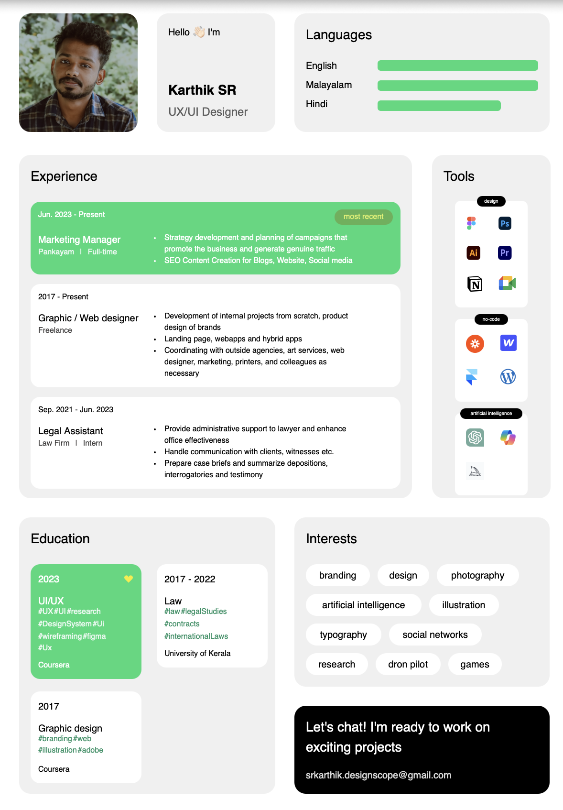

# Вступительный экзамен для Front-end разработчика

## Сверстанное резюме



## Описание
Это статическое резюме, сверстанное с использованием HTML и CSS с подключением кастомных шрифтов (`Tinkoff Sans`) и адаптивной версткой.

## Быстрый старт

### Установка зависимостей

Перед запуском проекта выполните команду:

```bash
npm install
```

Запустить можно с помощью

```bash
npm run dev